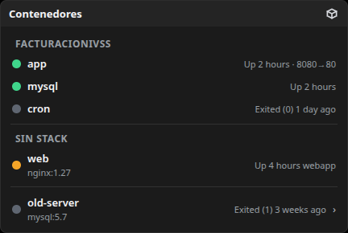
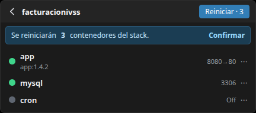
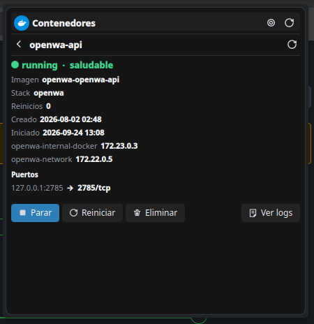
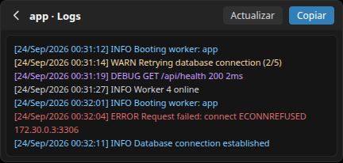
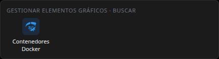

# Contenedores Docker · Plasma 6 Widget

Un widget para la barra de tareas de **Plasma 6** que muestra el estado de tus
contenedores Docker y te permite gestionarlos (iniciar, detener, reiniciar,
eliminar) y ver sus logs, todo sin abrir una terminal.


## Descargas

La última versión se publica en la pestaña **Releases**: incluye el widget
empaquetado (`.plasmoid`) y el código fuente comprimido (`.tar.gz` / `.zip`).

[Ir a los releases](https://github.com/JoseFEstevesP/plasma-dockctl/releases)

Instalación rápida con `gh`:

```bash
gh release download --repo JoseFEstevesP/plasma-dockctl --pattern "*.plasmoid"
kpackagetool6 -t Plasma/Applet -i org.gato99.dockctl.plasmoid
```

## Funcionalidades

- Listado de contenedores agrupados por **stack** (docker compose) con estado
  y salud (punto verde / naranja / gris).
- Acciones rápidas por contenedor: `start`, `stop`, `restart`, `remove`.
- Acción **"reiniciar todos"** por stack, con confirmación.
- Detalle de contenedor: ips, redes, puertos, fecha de creación/inicio,
  política de reinicio.
- Visor de logs con scroll, botón **Actualizar** y **Copiar al portapapeles**.
- Polling solo cuando el panel está abierto (silencioso en background).
- Alterna entre vista compacta y ampliada desde el diálogo de configuración.
- Icono compacto con el conteo de contenedores por stack.

## Capturas

Vista principal, detalle de stack, detalle de contenedor, visor de logs y
la entrada del widget en "Añadir widgets" (con el icono de Docker):











## Arquitectura

Dos piezas que se comunican por HTTP en localhost:

| Pieza | Dónde | Qué hace |
| --- | --- | --- |
| **Widget** | `plasmoid/` (QML/Plasma 6) | Interfaz en la barra. Habla con el backend solo en `127.0.0.1`. |
| **Backend** | `backend/backend.py` (Python stdlib) | Ejecuta `docker` y expone una API JSON en `127.0.0.1:8427`. |

El backend corre como servicio de **systemd a nivel de usuario** (`dockctl.service`)
con reinicio automático, por lo que no hace falta `sudo` ni `root`.

## Requisitos

- Plasma 6 (KDE) en Linux
- Docker funcionando (`docker ps` sin sudo; el usuario debe estar en el grupo `docker`)
- Python 3.9+
- systemd a nivel de usuario (integración habitual en Fedora, Arch, openSUSE, etc.)

## Instalación

```bash
git clone https://github.com/JoseFEstevesP/plasma-dockctl
cd plasma-dockctl
./install.sh
```

El instalador:

1. Copia el widget a `~/.local/share/plasma/plasmoids/`.
2. Instala el icono de Docker como icono de tema (para que se vea en el
   selector de widgets).
3. Copia el backend a `~/.local/share/dockctl/`.
4. Registra y arranca `dockctl.service` (recomienda reiniciar plasmashell).
5. Crea `~/.config/dockctl/config.ini` con los valores por defecto si no existe.

Después añade el widget con **clic derecho en la barra → Añadir widgets →
Contenedores Docker**.

### Instalación en un comando

```bash
git clone https://github.com/JoseFEstevesP/plasma-dockctl && cd plasma-dockctl && ./install.sh
```

### Instalar solo el widget desde un archivo local

Como con cualquier otro elemento gráfico, puedes instalar únicamente el widget
desde el archivo `dist/org.gato99.dockctl.plasmoid`:

1. Clic derecho en la barra → **Añadir o gestionar widgets**.
2. Abre el menú **Obtener nuevos widgets → Instalar desde archivo local…**.
3. Selecciona `org.gato99.dockctl.plasmoid`.

O desde terminal:

```bash
kpackagetool6 -t Plasma/Applet -i dist/org.gato99.dockctl.plasmoid
```

Para regenerar el paquete desde el código: `./build.sh`.

> El archivo `.plasmoid` solo instala la parte gráfica. El widget necesita el
> backend para funcionar: es el servicio que se instala con `./install.sh`,
> así que lo habitual es usar el instalador completo; la opción del archivo
> local sirve para probarlo o para actualizar el widget sin tocar el backend.

## Configuración

Edita `~/.config/dockctl/config.ini`:

```ini
[server]
port = 8427
host = 127.0.0.1
```

Y desde el propio widget (icono de la llave inglesa del diálogo ampliado):

| Opción | Descripción |
| --- | --- |
| Intervalo de refresco | Segundos entre consultas (mínimo 1). |
| Confirmar reinicio de stacks | Pide confirmación al reiniciar todos los contenedores de un stack. |
| Mostrar detenidos | Lista también los contenedores parados. |
| Puerto del backend | Debe coincidir con `port` del `config.ini`. |

> NOTA: si cambias el puerto, cambia la variable de entorno `DOCKCTL_PORT`
> del servicio (`systemctl --user edit dockctl`) o el `port` del `config.ini`,
> y reinicia el servicio con `systemctl --user restart dockctl`.

## API del backend

Base: `http://127.0.0.1:8427`

| Método | Ruta | Descripción |
| --- | --- | --- |
| `GET` | `/api/containers` | Lista de contenedores (running primero). |
| `GET` | `/api/containers/:name` | Detalle: ips, redes, puertos, salud, fechas. |
| `GET` | `/api/containers/:name/logs?lines=N` | Logs (N entre 1 y 5000, default 300). |
| `POST` | `/api/containers/:name/start` | Inicia un contenedor. |
| `POST` | `/api/containers/:name/stop` | Detiene un contenedor. |
| `POST` | `/api/containers/:name/restart` | Reinicia un contenedor. |
| `POST` | `/api/containers/:name/remove` | Elimina un contenedor (`docker rm -f`). |
| `POST` | `/api/stacks/:name/restart` | Reinicia todos los contenedores de un stack. |

Ejemplos:

```bash
curl -s http://127.0.0.1:8427/api/containers | jq '.containers[] | {name, running, stack}'
curl -s http://127.0.0.1:8427/api/containers/mi_contenedor
curl -s http://127.0.0.1:8427/api/stacks/mi_stack/restart -X POST
```

Errores de Docker en `GET` responden `200` con `{"ok": false, "error": "..."}`
(el widget los muestra en rojo); en `POST` responden `500`. Orígenes CORS no
locales reciben `403`.

## Desarrollo

```bash
# Tests del backend (no requieren docker real; se mockea el comando docker)
python3 backend/test_backend.py

# Instala/reinstala desde el repo
./install.sh
```

Estructura:

```
plasma-dockctl/
├── plasmoid/            # El widget (metadata + contents/)
│   └── contents/ui/     # main.qml, StackSection.qml, PageHeader.qml, ...
├── backend/
│   ├── backend.py       # Servidor HTTP + capa docker
│   └── test_backend.py
├── systemd/
│   └── dockctl.service  # Unidad de usuario
├── install.sh
└── uninstall.sh
```

## Desinstalación

```bash
./uninstall.sh
```

Detiene el servicio, borra el widget, el icono de tema y la unidad systemd
(mantiene los archivos de backend y configuración).

> Nota: el botón de borrar del panel "Añadir o gestionar widgets" **solo retira
> el widget de la barra**; no desinstala el paquete. Para quitar el widget sin
> tocar el backend: `kpackagetool6 -t Plasma/Applet -r org.gato99.dockctl`.

## Licencia

GPL-3.0 — ver [LICENSE](LICENSE).