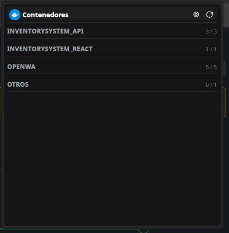
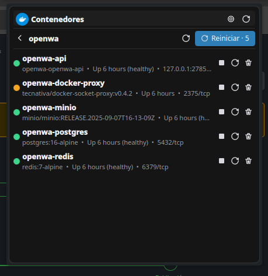
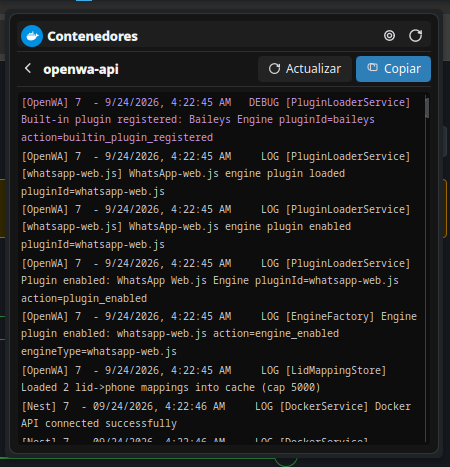

# Contenedores Docker · Plasma 6 Widget

Un widget para la barra de tareas de **Plasma 6** que muestra el estado de tus
contenedores Docker y te permite gestionarlos (iniciar, detener, reiniciar,
eliminar) y ver sus logs, todo sin abrir una terminal.


## Descargas

La última versión se publica en la pestaña **Releases**: incluye el widget
empaquetado (`.plasmoid`) y el código fuente comprimido (`.tar.gz` / `.zip`).

[Ir a los releases](https://github.com/JoseFEstevesP/plasma-dockctl/releases)

Instalación rápida (instala el widget **y** el backend que necesita):

```bash
git clone https://github.com/JoseFEstevesP/plasma-dockctl && cd plasma-dockctl && ./install.sh
```

> El archivo `.plasmoid` de la release contiene solo la parte gráfica. Si lo
> instalas tal cual, el widget aparecerá en la barra pero se quedará sin
> backend. Ver [Instalación](#instalación).

## Funcionalidades

- Listado de contenedores agrupados por **stack** (docker compose) con estado
  y salud (punto verde / naranja / gris).
- Acciones rápidas por contenedor: `start`, `stop`, `restart`, `remove`.
- Acción **"reiniciar todos"** por stack, con confirmación.
- Detalle de contenedor: ips, redes, puertos, fecha de creación/inicio,
  política de reinicio y **diagnóstico** (salud degradada, reinicios en bucle,
  puertos abiertos a la red local, falta de límites o de política de reinicio).
- Visor de logs con scroll, botón **Actualizar**, **Copiar al portapapeles** y
  filtro por nivel (**Todos**, **Avisos+**, **Errores**).
- Procesos del contenedor (`docker top`) con lectura de CPU, memoria y comando.
- Página de **Consumo**: qué contenedor gasta más CPU, RAM, red, disco o
  procesos, ordenable por métrica y con barras comparativas.
- Chip en la cabecera con el contenedor que más CPU está usando (configurable).
- Página de **Análisis**: espacio en disco recuperable (imágenes, volúmenes,
  caché de build) y hallazgos priorizados, con botones de limpieza que piden
  confirmación.
- Polling solo cuando el panel está abierto (silencioso en background).
- Alterna entre vista compacta y ampliada desde el diálogo de configuración.
- Icono compacto con el conteo de contenedores por stack.

### Consumo y Análisis: por qué no saturan el sistema

`docker stats` tarda unos 2 s y `docker system df` unos 5-8 s, así que ninguno
de los dos se ejecuta en el bucle de refresco:

- La **lista principal** sigue igual: solo `docker ps` (rápido) cada 5 s.
- La página de **Consumo** mide por su cuenta según el intervalo configurado
  (10 s por defecto) y el backend cachea 10 s, así que abrirla dos veces seguidas
  no duplica el trabajo.
- La página de **Análisis** usa una caché de 5 minutos; el botón de refresco
  fuerza una medición real de todo.

### Limpieza: qué se puede ejecutar y qué no

Desde **Análisis** se puede liberar espacio con confirmación previa. Cada
comando se muestra en el diálogo antes de ejecutarlo:

| Botón | Comando | Nota |
| --- | --- | --- |
| Liberar caché de build | `docker builder prune -f` | Solo caché de compilación. |
| Liberar sin etiqueta | `docker image prune -f` | Imágenes sin etiqueta. |
| Liberar todas (agresivo) | `docker image prune -a -f` | También borra imágenes que no usa ningún contenedor: habrá que volver a descargarlas. |
| Eliminar detenidos | `docker container prune -f` | Se pierden logs y configuración de los parados. |
| Volúmenes sin usar | `docker volume prune` | **No se ejecuta**: el widget solo muestra el comando para copiarlo, porque los volúmenes pueden contener datos. |

El backend acepta únicamente esos destinos; cualquier otro se rechaza con
`400`, y los volúmenes se rechazan siempre.


## Capturas

Vista principal, detalle de stack, detalle de contenedor y visor de logs:








## Arquitectura

Dos piezas que se comunican por HTTP en localhost:

| Pieza | Dónde | Qué hace |
| --- | --- | --- |
| **Widget** | `plasmoid/` (QML/Plasma 6) | Interfaz en la barra. Habla con el backend solo en `127.0.0.1`. |
| **Backend** | `backend/backend.py` (Python stdlib) | Ejecuta `docker` y expone una API JSON en `127.0.0.1:8427`. |

El backend corre como servicio de **systemd a nivel de usuario** (`dockctl.service`)
con reinicio automático, por lo que no hace falta `sudo` ni `root`.

## Requisitos

- Plasma 6 (KDE) en Linux
- Docker funcionando (`docker ps` sin sudo; el usuario debe estar en el grupo `docker`)
- Python 3.9+
- systemd a nivel de usuario (integración habitual en Fedora, Arch, openSUSE, etc.)

## Instalación

### Arch: AUR

Todavía no está publicado. El registro de cuentas nuevas del AUR está cerrado
temporalmente por un [incidente de seguridad](https://archlinux.org/news/active-aur-malicious-packages-incident/)
y no hay fecha de reapertura. El `PKGBUILD` está preparado en
[`aur/PKGBUILD`](aur/PKGBUILD) y se publicará en cuanto se reabra.

### Cualquier distro: instalador completo (recomendado)

```bash
git clone https://github.com/JoseFEstevesP/plasma-dockctl
cd plasma-dockctl
./install.sh
```

O en una sola línea:

```bash
git clone https://github.com/JoseFEstevesP/plasma-dockctl && cd plasma-dockctl && ./install.sh
```

El instalador:

1. Copia el widget a `~/.local/share/plasma/plasmoids/`.
2. Instala el icono de Docker como icono de tema (para que se vea en el
   selector de widgets).
3. Copia el backend a `~/.local/share/dockctl/`.
4. Registra y arranca `dockctl.service` (recomienda reiniciar plasmashell).
5. Crea `~/.config/dockctl/config.ini` con los valores por defecto si no existe.

Después añade el widget con **clic derecho en la barra → Añadir widgets →
Contenedores Docker**, y reinicia plasmashell si no aparece:

```bash
kquitapp6 plasmashell && plasmashell
```

Para actualizar más adelante, sin volver a instalar nada:

```bash
git pull && ./update.sh --backend --no-dist
```

(`--no-dist` porque quien solo instala no necesita los paquetes de
distribución; `--backend` sí, para copiar el backend nuevo y reiniciar el
servicio.)

### Solo el widget, desde el archivo `.plasmoid`

Como con cualquier otro elemento gráfico, puedes instalar únicamente la parte
gráfica desde el archivo `org.gato99.dockctl.plasmoid` de la release:

1. Clic derecho en la barra → **Añadir o gestionar widgets**.
2. Abre el menú **Obtener nuevos widgets → Instalar desde archivo local…**.
3. Selecciona `org.gato99.dockctl.plasmoid`.

O desde terminal:

```bash
kpackagetool6 -t Plasma/Applet -i org.gato99.dockctl.plasmoid
```

Para regenerar el paquete desde el código: `./build.sh`.

> Esta vía instala **solo la interfaz**. El widget necesita el backend para
> funcionar, y es el servicio que instala `./install.sh`; úsala para probarlo o
> para actualizar el widget sin tocar el backend, no como instalación
> completa.

## Configuración

Edita `~/.config/dockctl/config.ini`:

```ini
[server]
port = 8427
host = 127.0.0.1
```

Y desde el propio widget (icono de la llave inglesa del diálogo ampliado):

| Opción | Descripción |
| --- | --- |
| Intervalo de refresco | Segundos entre consultas (mínimo 1). |
| Intervalo de medición de consumo | Segundos entre mediciones de la página de Consumo, de 5 a 120 (10 por defecto). |
| Confirmar antes de eliminar un contenedor | Pide confirmación al eliminar. Las limpiezas de la página de Análisis piden confirmación siempre. |
| Mostrar detenidos | Lista también los contenedores parados. |
| Mostrar el contenedor que más CPU usa en la cabecera | Activa o oculta el chip de consumo. |
| Puerto del backend | Debe coincidir con `port` del `config.ini`. |

> NOTA: si cambias el puerto, cambia la variable de entorno `DOCKCTL_PORT`
> del servicio (`systemctl --user edit dockctl`) o el `port` del `config.ini`,
> y reinicia el servicio con `systemctl --user restart dockctl`.

## API del backend

Base: `http://127.0.0.1:8427`

| Método | Ruta | Descripción |
| --- | --- | --- |
| `GET` | `/api/containers` | Lista de contenedores (running primero). |
| `GET` | `/api/containers/:name` | Detalle: ips, redes, puertos, salud, fechas y diagnóstico. |
| `GET` | `/api/containers/:name/logs?lines=N` | Logs (N entre 1 y 5000, default 300). |
| `GET` | `/api/containers/:name/top` | Procesos del contenedor (`docker top`, 200 filas). |
| `GET` | `/api/stats?refresh=1` | Consumo por contenedor (CPU, RAM, red, disco, pids). Cacheado 10 s. |
| `GET` | `/api/analysis?refresh=1` | Espacio en disco y hallazgos. Cacheado 5 min. |
| `POST` | `/api/containers/:name/start` | Inicia un contenedor. |
| `POST` | `/api/containers/:name/stop` | Detiene un contenedor. |
| `POST` | `/api/containers/:name/restart` | Reinicia un contenedor. |
| `POST` | `/api/containers/:name/remove` | Elimina un contenedor (`docker rm -f`). |
| `POST` | `/api/stacks/:name/restart` | Reinicia todos los contenedores de un stack. |
| `POST` | `/api/maintain/:target` | Limpieza: `images-safe`, `images-all`, `containers`, `buildcache`. |

Ejemplos:

```bash
curl -s http://127.0.0.1:8427/api/containers | jq '.containers[] | {name, running, stack}'
curl -s http://127.0.0.1:8427/api/containers/mi_contenedor | jq '.detail.diagnostics'
curl -s http://127.0.0.1:8427/api/stats | jq '{top, total}'
curl -s http://127.0.0.1:8427/api/analysis | jq '.findings[] | {severity, title}'
curl -s http://127.0.0.1:8427/api/stacks/mi_stack/restart -X POST
```

`/api/maintain/volumes` responde siempre `400`: los volúmenes nunca se borran
desde el widget. Los destinos fuera de la lista también se rechazan con `400`.

Errores de Docker en `GET` responden `200` con `{"ok": false, "error": "..."}`
(el widget los muestra en rojo); en `POST` responden `500`. Orígenes CORS no
locales reciben `403`.


## Desarrollo

```bash
# Tests del backend (no requieren docker real; se mockea el comando docker)
python3 backend/test_backend.py

# Comprobar el QML con el motor de Qt (compila todos los .qml e instancia las vistas)
python3 -c "
import os; os.environ.setdefault('QT_QPA_PLATFORM','offscreen')
from PySide6.QtGui import QGuiApplication
from PySide6.QtQml import QQmlComponent, QQmlEngine
from PySide6.QtCore import QUrl
app = QGuiApplication([]); e = QQmlEngine(); e.addImportPath('/usr/lib64/qt6/qml')
import pathlib
for p in sorted(pathlib.Path('plasmoid/contents/ui').glob('*.qml')):
    c = QQmlComponent(e, QUrl.fromLocalFile(str(p.resolve())))
    print('FALLA' if c.isError() else 'ok', p.name, [x.toString() for x in c.errors()])
"

# Instala/reinstala desde el repo
./install.sh
```

Estructura:

```
plasma-dockctl/
├── plasmoid/            # El widget (metadata + contents/)
│   └── contents/ui/     # main.qml, StatsView.qml, AnalysisView.qml, TopView.qml, ...
├── backend/
│   ├── backend.py       # Servidor HTTP + capa docker
│   └── test_backend.py
├── systemd/
│   └── dockctl.service  # Unidad de usuario
├── aur/
│   └── PKGBUILD         # Paquete para el AUR
├── docs/screenshots/    # Capturas del README
├── install.sh
├── update.sh            # Actualiza el widget instalado y regenera dist/
├── build.sh             # Genera dist/org.gato99.dockctl.plasmoid
└── uninstall.sh
```

## Desinstalación

```bash
./uninstall.sh
```

Detiene el servicio, borra el widget, el icono de tema y la unidad systemd
(mantiene los archivos de backend y configuración).

> Nota: el botón de borrar del panel "Añadir o gestionar widgets" **solo retira
> el widget de la barra**; no desinstala el paquete. Para quitar el widget sin
> tocar el backend: `kpackagetool6 -t Plasma/Applet -r org.gato99.dockctl`.

## Licencia

GPL-3.0 — ver [LICENSE](LICENSE).